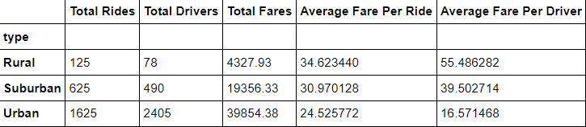
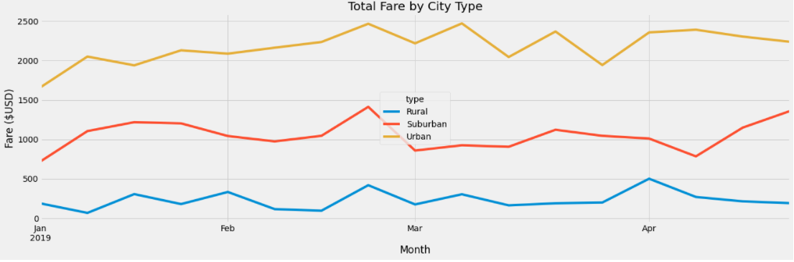

# PyBer_Analysis

## Overview of the analysis: 
  
  The purpose of the analysis was to analyze rideshare data of 3 city types: urban, suburban. and rural. Using this data, the total number of rides, the total number of drivers, the total fares, the average fares per ride, average fares per driver for each type of city were calculated. Using this data, one can draw conclusions about the correlation of city type on all of these factors. In the second half of the analysis, the effect of city type over the time period between January and April 2019 on driver fares was examined. After conducting this analysis, one can see the effect of city type on rider fares. 

## Results: 
  
  The analysis displayed that urban cities had the greatest number of rides, greatest number of drivers, and greatest amount of fares accumulated, followed by suburban cities, and then rural cities, which had the lowest numbers. Average fare per ride, however, was the lowest in urban cities, with an average fare of $24.53 per ride. Average fare per driver was similarly the lowest in urban cities at $16.57 per driver. Suburban cities had higher average fares than urban cities, with an average fare per ride of $30.97 and an average fare per driver of $39.50. Rural cities had the highest average fares, which an average fare per ride of $34.62, ad an average fare per driver of $55.49. The results of the first analysis can be displayed below:
  
  
 
 The second analysis results displayed that rural cities received the lowest total fares. Suburban cities had the second-lowest total fares. Urban cities had the highest total fares accumulated. The highest total point for fares in rural cities was the first week of April. The highest total point for fares in suburban and urban cities was in the last week of February. Rural cities also experienced a high point in the last week of February. 
 

## Summary: 
  
  Based on the results, one business recommendations to make to the CEO for addressing any disparities among the city types would be to increase incentives for drivers in rural areas to increase the number of drivers in those cities. An incentive could be that drivers in rural areas receive a higher percentage of their fare income than those in urban and suburban cities. The more drivers there are in those areas, the more likely it is that people will choose to utilize the ridesharing service.
  Another recommendation that one can make to the CEO is to increase the fare price in urban areas during peak times since urban areas have the lowest fares overall, but provide the highest total accumulated fares. Increasing urban fare prices during peak times would allow Pyber to take advantage of the fact that most of their profits come from the urban cities.
  A third suggestion would be to offer a rideshare pool option for riders in rural areas, where they can share rides with other riders going to different destinations in close vicinity of each other, with a lowered fare per person as an incentive. This would encourage more rural riders to take advantage of the Pyber service, since it would be more affordable to them. 
